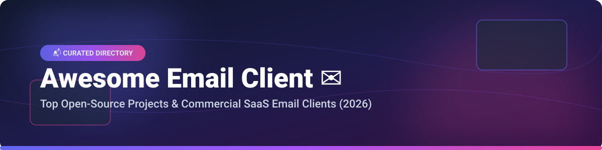

  

# 📬 Awesome Email Client ✉️

 

**Curated List of Commercial SaaS/Hosted Email Platforms & Open-Source GitHub Email Client Projects**

*Comprehensive guide to Desktop Email Clients, Webmail Apps, Privacy-First Email Providers, Self-Hosted Email Stacks, and Mobile Email Apps.*

**Last updated: October 2026**

---

## 💡 Overview & SEO Summary

Welcome to the definitive **Awesome Email Client** resource hub! Whether you are seeking a **privacy-focused email client**, a **keyboard-driven power-user desktop client**, a **self-hosted webmail application**, or an **AI-powered inbox assistant**, this curated directory covers both industry-leading SaaS solutions and high-star open-source projects.

### 🌟 Key Categories Covered
- **🖥️ Desktop Email Clients**: Native apps for macOS, Windows, and Linux (e.g., Thunderbird, Mailspring, Geary, Mailbird, Apple Mail).
- **🔒 Privacy & Encrypted Email**: Zero-knowledge and end-to-end encrypted solutions (e.g., Proton Mail, Tuta, FairEmail).
- **🚀 AI & Productivity Inboxes**: High-speed, automated email tools (e.g., Superhuman, Shortwave, Spark Mail).
- **🌐 Self-Hosted Webmail**: Modern web interfaces for IMAP/JMAP servers (e.g., Roundcube, Cypht, SnappyMail).
- **📱 Mobile Email Apps**: Secure and customizable clients for Android and iOS (e.g., Thunderbird for Android / K-9 Mail, FairEmail).

---

## 📖 Table of Contents

- [☁️ SaaS & Commercial Email Platforms](#-saas--commercial-email-platforms)
- [🔓 Open-Source GitHub Projects](#-open-source-github-projects)
- [🤝 How to Contribute](#-how-to-contribute)
- [💖 Support & Sponsorship](#-support--sponsorship)
- [⚠️ Disclaimer](#%EF%B8%8F-disclaimer)
- [📊 Star History](#-star-history)

---

## ☁️ SaaS & Commercial Email Platforms

> **📊 Sector Market Context & Industry Dynamics**: The global email client and provider software market is estimated at **~$12.5 Billion in 2026** and projected to surpass **~$25 Billion by 2032**. The sector is **moderately fragmented** — dominated at the enterprise base layer by ecosystem giants **Microsoft Outlook** and **Google Gmail**, while specialized niches thrive independently: **Superhuman** and **Shortwave** control the premium AI productivity tier, **Proton Mail** and **Tuta** lead privacy-first encrypted communications, and **Zoho Mail** captures cost-sensitive SMBs.

Below is a comparative breakdown of top commercial SaaS email platforms sorted by **Company Revenue / Valuation (Descending)**:

| 🏢 Platform | 📝 Description | 💵 Pricing (Starting Paid Tier) | 🎁 Free Tier / Trial Limits | 📊 Company Size (Valuation / Revenue) |
|:---|:---|:---|:---|:---|
| **[Apple Mail](https://www.apple.com/mail/)** | 🍎 Native Apple ecosystem client integrated into macOS & iOS with Mail Privacy Protection. | **$0.99/mo** (iCloud+ starting plan for custom domain support). | **100% Free** app included with Apple hardware; standard iCloud provides 5 GB storage. | **~$400B Revenue** (Apple FY2025) |
| **[Gmail / Google Workspace](https://mail.google.com/)** | 🌐 World's largest webmail platform with advanced spam filtering & Workspace integrations. | **$6.00/user/mo** (Business Starter tier). | **15 GB free storage** shared across Gmail, Google Drive, and Photos. | **~$350B Revenue** (Alphabet FY2025) |
| **[Microsoft Outlook](https://www.microsoft.com/en-us/microsoft-365/outlook/email-and-calendar-software-microsoft-outlook)** | 💼 Enterprise standard email, calendar & contacts client for Windows, Mac & Web. | **$1.99/mo** or $19.99/yr (Microsoft 365 Basic). | **Free web/mobile version** with ads and 15 GB email mailbox storage. | **~$281B Revenue** (Microsoft FY2025) |
| **[Proton Mail](https://proton.me/mail)** | 🛡️ Swiss-based end-to-end encrypted email client and privacy suite. | **$4.99/mo** (or $3.99/mo billed annually for Mail Plus). | **1 GB free storage**, 1 email address, max 150 messages/day. | **~$3.0B Valuation** (Est.) |
| **[Zoho Mail](https://www.zoho.com/mail/)** | 💼 Secure, ad-free business email hosting with custom domain support and admin panel. | **$1.00/user/mo** (Mail Lite 5 GB tier). | **Forever Free Plan**: Up to 5 users, 5 GB storage/user, 25 MB attachment limit (Web only). | **~$1.2B Revenue** (Zoho Corp Est.) |
| **[Superhuman](https://superhuman.com/)** | ⚡ Blazing-fast keyboard-first email experience with built-in AI triage and read receipts. | **$30.00/user/mo** (Individual plan). | **No permanent free plan**; offers a 14-day free trial. | **~$825M Valuation** (Est.) |
| **[Shortwave](https://www.shortwave.com/)** | 🤖 AI-powered email client built on top of Gmail with instant summaries and automated workflows. | **$7.00/user/mo** (Personal Pro plan). | **Free plan**: 90-day searchable history, 10 AI credits/mo, basic organization. | **~$150M Valuation** (Est.) |
| **[Spark Mail](https://sparkmailapp.com/)** | ⚡ Cross-platform smart email client (Mac, iOS, Windows, Android) with team collaboration. | **$4.99/user/mo** (billed annually for Premium). | **Free plan**: Smart Inbox, basic search, cross-device sync, standard notifications. | **~$100M Valuation** (Readdle Est.) |
| **[Mailbird](https://www.getmailbird.com/)** | 🪟 Unified Windows desktop email app supporting multi-account management and app integrations. | **$2.25/mo** (Standard plan billed annually). | **No permanent free plan**; offers a 14-day full-feature free trial. | **~$30M Valuation** (Est.) |
| **[Clean Email](https://clean.email/)** | 🧹 Smart inbox cleaner app for bulk unsubscribing, automated cleaning, and organization. | **$9.99/mo** (Single account plan). | **Free trial**: Cleans up to 1,000 emails for free before requiring a paid plan. | **~$15M Valuation** (Est.) |

---

## 🔓 Open-Source GitHub Projects

Below is a curated list of production-grade open-source email clients, webmail applications, and terminal tools, sorted by **GitHub Star Count (Descending)**:

| 📦 Repository & Description | ⭐ Star Count |
|:---|:---|
| **[Thunderbird](https://github.com/mozilla/releases-comm-central)** — 🦅 The flagship cross-platform open-source desktop email, calendar, and contacts client (MPL-2.0). |  |
| **[Mailspring](https://github.com/Foundry376/Mailspring)** — 🚀 Fast, beautiful desktop email client for Windows, Mac, and Linux built on a C++ sync engine (GPL-3.0). |  |
| **[Thunderbird for Android (K-9 Mail)](https://github.com/thundernest/k-9)** — 📱 Full-featured, privacy-respecting open-source Android email client (Apache-2.0). |  |
| **[Roundcube Webmail](https://github.com/roundcube/roundcubemail)** — 🌐 Browser-based multilingual IMAP webmail client with an application-like UI (GPL-3.0). |  |
| **[FairEmail](https://github.com/M66B/FairEmail)** — 🔒 Open-source, privacy-oriented email app for Android with encryption and anti-phishing protection (GPL-3.0). |  |
| **[NeoMutt](https://github.com/neomutt/neomutt)** — 💻 Sophisticated command-line text-based email client with Notmuch indexing and PGP support (GPL-2.0). |  |
| **[aerc](https://github.com/aerc/aerc)** — ⚡ TUI email client designed specifically for system administrators and terminal power users (MIT). |  |
| **[Cypht](https://github.com/cypht-org/cypht)** — 🌐 Lightweight, modular self-hosted webmail aggregator combining IMAP, JMAP, and RSS feeds (LGPL-2.1). |  |
| **[SnappyMail](https://github.com/the-djfear/snappymail)** — ⚡ Ultra-fast, lightweight PHP webmail script designed as a modern fork of RainLoop (GPL-3.0). |  |
| **[Geary](https://github.com/GNOME/geary)** — 🐧 Modern conversation-focused email client built for GNOME Linux desktop environments (LGPL-2.1). |  |
| **[GNOME Evolution](https://github.com/GNOME/evolution)** — 🗓️ Complete Linux personal information management suite with integrated email, calendar, and contacts (LGPL-2.1). |  |
| **[Aerion](https://github.com/hkdb/Aerion)** — 🐧 Modern Linux-first desktop email client with tracking element removal and focus mode (GPL-3.0). |  |
| **[Trojitá](https://github.com/KDE/trojita)** — ⚡ Fast, lightweight Qt IMAP email client developed under the KDE project umbrella (GPL-2.0). |  |
| **[Claws Mail](https://github.com/claws-mail/claws)** — ⚡ Lightweight GTK+ email client and newsreader with extensible plugin support (GPL-3.0). |  |
| **[Balsa](https://github.com/GNOME/balsa)** — 🐧 Traditional GNOME email client built for simplicity and lightweight resource usage (GPL-2.0). |  |
| **[Sylpheed](https://github.com/sylpheed/sylpheed)** — 🍃 Lightweight and user-friendly GTK+ email client with high keyboard accessibility (GPL-2.0). |  |

---

## 🤝 How to Contribute

Contributions are welcome! Please follow these simple guidelines:

1. 🍴 **Fork** this repository.
2. 📝 **Add/Edit** your proposed project or platform in `README.md` maintaining table formats.
3. 📌 **Include** name, clean markdown URL, detailed summary, pricing/stars metadata.
4. 🚀 **Submit a Pull Request** with a concise description of your changes.

---

## 💖 Support & Sponsorship

If you find this directory helpful for discovering email software, please consider supporting the project:

- ⭐ **Star** this repository on GitHub!
- 🔀 **Fork** and share it with fellow developers and email enthusiasts.
- ☕ **Buy me a coffee**: Support ongoing open-source maintenance via [GitHub Sponsors](https://github.com/sponsors/ishandutta2007).

Thank you for being part of the open-source community! 💖

---

## ⚠️ Disclaimer

- This list is **community-curated** for educational purposes and does not represent official financial advice or software endorsement.
- All brand names, product logos, and trademarks belong to their respective owners.
- Free tier and pricing information are accurate as of **October 2026** but may change over time.

---

## 📊 Star History

